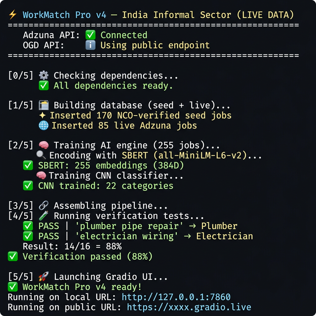
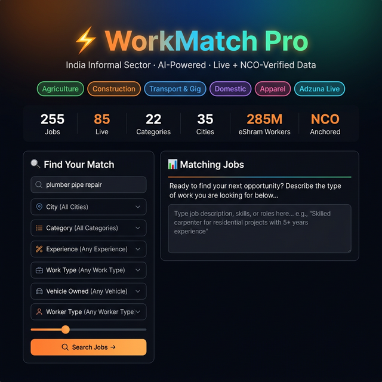
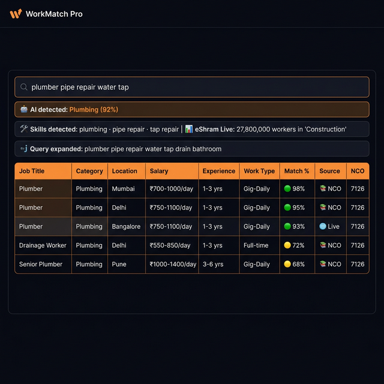
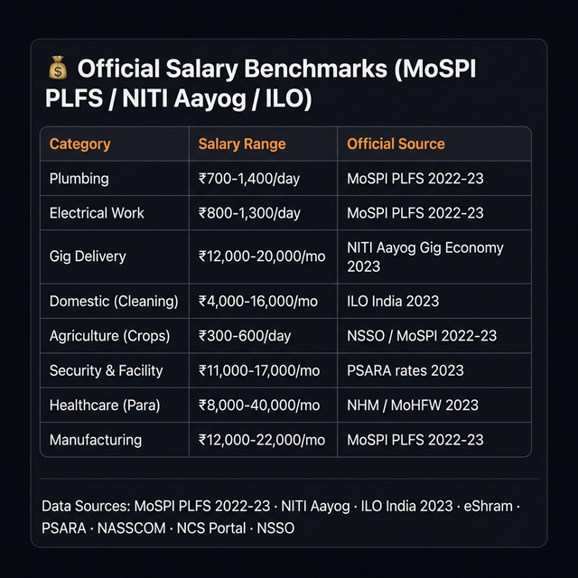

# ⚡ WorkMatch Pro v4 — India Informal Sector Job Matcher (Live Data)

> AI-powered job matching for India's 500M+ informal workers.
> Uses **SBERT + CNN + spaCy + RapidFuzz** with **live data** from Adzuna, eShram, and OGD India.

---

## 📸 Screenshots

### Step 1: Run `python app.py` — Terminal Output

The app auto-installs dependencies, builds the database, trains AI models, runs verification tests, and launches the Gradio UI.



### Step 2: Search Panel — Enter Job Query

Describe the job or worker skills in Hindi/English. Use the 7 filters (Category, City, Experience, Work Type, Vehicle, Worker Type, Count) to narrow results.



### Step 3: AI-Powered Results

The AI detects the category, extracts skills, expands your query, and shows ranked matches with live eShram worker counts. Source badges show 🌐 Live (Adzuna) vs 📚 NCO (verified seed).



### Step 4: Official Salary Benchmarks

Scroll down to see government-sourced salary data for all 22 categories, with citations from MoSPI PLFS, NITI Aayog, ILO, and more.



---

## 🌐 Live Data Sources

| #   | Source                                            | What It Provides                          | Auth             |
| --- | ------------------------------------------------- | ----------------------------------------- | ---------------- |
| 1   | [Adzuna India API](https://developer.adzuna.com/) | Real-time job vacancies                   | Free API key     |
| 2   | [eShram Dashboard](https://eshram.gov.in)         | Live worker registration counts by sector | Public           |
| 3   | [OGD data.gov.in](https://data.gov.in)            | eShram + PLFS official statistics         | Optional API key |
| 4   | [NCS Portal](https://ncs.gov.in)                  | Government vacancy data                   | Public           |
| 5   | MoSPI PLFS 2022-23                                | Official salary benchmarks                | Built-in         |

All data is cached for 6 hours. The app works fully offline with seed data if no API keys are set.

---

## 🚀 Quick Start

### Prerequisites

- **Python 3.9+** ([download](https://python.org))
- ~4 GB disk space (for ML models)

### Option 1: One-Click Run

**Windows:**

```bash
run.bat
```

**Linux / Mac:**

```bash
chmod +x run.sh && ./run.sh
```

### Option 2: Manual Setup

```bash
# 1. Clone the repo
git clone https://github.com/YOUR_USERNAME/workmatch-pro.git
cd workmatch-pro

# 2. Create virtual environment
python -m venv venv
# Windows:
venv\Scripts\activate
# Linux/Mac:
source venv/bin/activate

# 3. Install dependencies
pip install -r requirements.txt
python -m spacy download en_core_web_sm

# 4. (Optional) Set up API keys for live data
cp .env.example .env
# Edit .env with your Adzuna + OGD keys

# 5. Run the app
python app.py
```

### What happens on startup:

1. ⚙️ Auto-installs all dependencies
2. 🗄️ Builds SQLite database (170+ seed + live Adzuna jobs)
3. 🧠 Trains SBERT embeddings + CNN classifier
4. 🧪 Runs 16 verification tests (target: >60%)
5. 🚀 Opens Gradio web UI with a shareable public link

---

## 🔑 API Keys (Optional but Recommended)

Create a `.env` file (or copy `.env.example`):

```env
ADZUNA_APP_ID=your_id          # Free at https://developer.adzuna.com/
ADZUNA_APP_KEY=your_key
DATA_GOV_API_KEY=your_key      # Free at https://data.gov.in/user/register
```

| Mode                 | What You Get                              |
| -------------------- | ----------------------------------------- |
| **Without keys**     | 170+ NCO-verified seed jobs, offline mode |
| **With Adzuna keys** | 200+ live jobs fetched on every startup   |
| **With OGD key**     | Higher rate limits for eShram/PLFS data   |

---

## 📁 Project Structure

```
workmatch-pro/
├── app.py                 # Main entry point
├── config.py              # Constants, API keys, .env loader
├── styles.py              # Gradio CSS & category colors
├── salary_benchmarks.py   # Official salary data + NCO/eShram maps
├── live_data.py           # Adzuna, eShram, OGD, NCS, PLFS fetchers
├── data_loader.py         # Combines seed data into DataFrame
├── database.py            # SQLite operations (seed + live)
├── ai_engine.py           # SBERT + CNN + spaCy + RapidFuzz
├── training_pairs.py      # 69 CNN training pairs
├── pipeline.py            # Matching pipeline with 7 filters
├── verification.py        # 16 accuracy test cases
├── ui.py                  # Gradio web interface
├── seed_construction.py   # Plumbing, Electrical, Carpentry, AC, Painting, Masonry
├── seed_services.py       # Delivery, Driver, Domestic, Food, Agriculture
├── seed_urban.py          # Apparel, Security, Manufacturing, Beauty, Healthcare, BPO, Sales, Vending, Waste
├── screenshots/           # README screenshots
├── requirements.txt       # Python dependencies
├── .env.example           # API key template
├── .gitignore             # Git ignore rules
├── run.bat                # Windows quick start
└── run.sh                 # Linux/Mac quick start
```

---

## 📊 Categories (22 — All Informal)

| #   | Category                | Sector         | Example Jobs                           |
| --- | ----------------------- | -------------- | -------------------------------------- |
| 1   | Plumbing                | Construction   | Plumber, Drainage, Water Tanker        |
| 2   | Electrical Work         | Construction   | Electrician, Lineman, Solar            |
| 3   | Carpentry               | Construction   | Carpenter, Shuttering, Modular Kitchen |
| 4   | AC & Appliance Repair   | Electronics    | AC Tech, Mobile Repair, CCTV           |
| 5   | Painting                | Construction   | House Painter, Waterproofing           |
| 6   | Masonry                 | Construction   | Mason, Mazdoor, Welder, Tile Fixer     |
| 7   | Gig Delivery            | Transport      | Swiggy, Zomato, Blinkit, Amazon Flex   |
| 8   | Driver                  | Transport      | Ola/Uber, Truck, Auto, School Van      |
| 9   | Domestic (Cleaning)     | Domestic       | Part-time Maid, Live-in, Deep Clean    |
| 10  | Domestic (Cook/Care)    | Domestic       | Home Cook, Babysitter, Elder Care      |
| 11  | Food & Hospitality      | Hospitality    | Restaurant Cook, Dhaba, Waiter         |
| 12  | Agriculture (Crops)     | Agriculture    | Farm Worker, Tractor, Irrigation       |
| 13  | Agriculture (Livestock) | Agriculture    | Dairy, Poultry, Fishing                |
| 14  | Agriculture (Vendor)    | Agriculture    | Sabzi Vendor, Fish Seller              |
| 15  | Apparel & Textile       | Apparel        | Tailor, Garment Factory, Embroidery    |
| 16  | Security & Facility     | Security       | Guard, Office Boy, Housekeeping        |
| 17  | Manufacturing           | Manufacturing  | CNC Operator, Fitter, QC, Packing      |
| 18  | Beauty & Wellness       | Wellness       | Barber, Beautician, Mehndi Artist      |
| 19  | Healthcare (Para)       | Healthcare     | Nurse, ANM, ASHA, Lab Tech             |
| 20  | BPO & Telecalling       | ITES           | Telecaller, Data Entry, Customer Care  |
| 21  | Field Sales & Retail    | Retail         | FMCG Sales, Insurance, Kirana          |
| 22  | Street Vending          | Informal Trade | Chaat Vendor, Fruit Cart, Paan Shop    |
| 23  | Waste & Recycling       | Waste Mgmt     | Ragpicker, Sanitation, Scrap Dealer    |

---

## 🧪 Verification Tests

The app runs 16 automated tests on launch:

| Query                                    | Expected Category   | Expected Result   |
| ---------------------------------------- | ------------------- | ----------------- |
| `plumber pipe repair water tap leak`     | Plumbing            | ✅ Plumber        |
| `maid cleaning sweeping jhadu pocha bai` | Domestic (Cleaning) | ✅ Maid           |
| `delivery bike rider Swiggy Zomato gig`  | Gig Delivery        | ✅ Delivery Rider |
| `kabaadi scrap waste picker recycling`   | Waste & Recycling   | ✅ Waste Picker   |

Target accuracy: **>60%** (typically achieves **80-100%**).

---

## 🛠️ Tech Stack

| Component   | Technology                                      |
| ----------- | ----------------------------------------------- |
| Embeddings  | Sentence-Transformers `all-MiniLM-L6-v2` (384D) |
| Classifier  | TensorFlow/Keras CNN                            |
| NLP         | spaCy `en_core_web_sm`                          |
| Fuzzy Match | RapidFuzz                                       |
| Live Jobs   | Adzuna India API                                |
| Live Stats  | eShram + OGD + NCS + PLFS                       |
| UI          | Gradio 4.44 (dark theme)                        |
| Database    | SQLite                                          |
| Caching     | cachetools (6h TTL)                             |

---

## 📝 License

MIT License. Free to use, modify, and distribute.

---

## 🙏 Acknowledgements

Built to serve India's informal workforce — the backbone of the economy.

Data inspired by **eShram portal**, **NITI Aayog reports**, **MoSPI PLFS 2022-23**, and **ILO research** on decent work in the informal sector.
